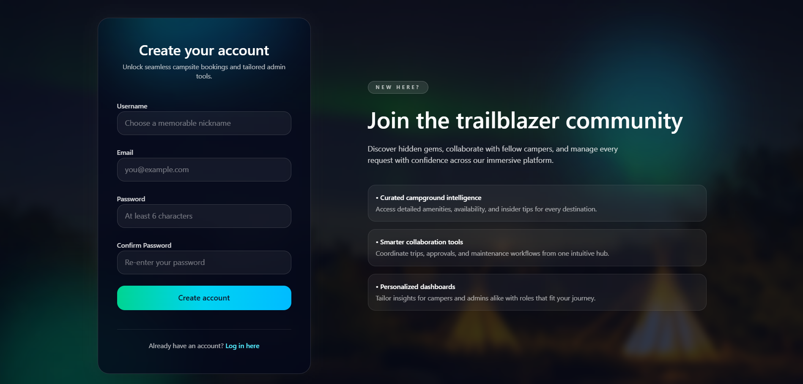
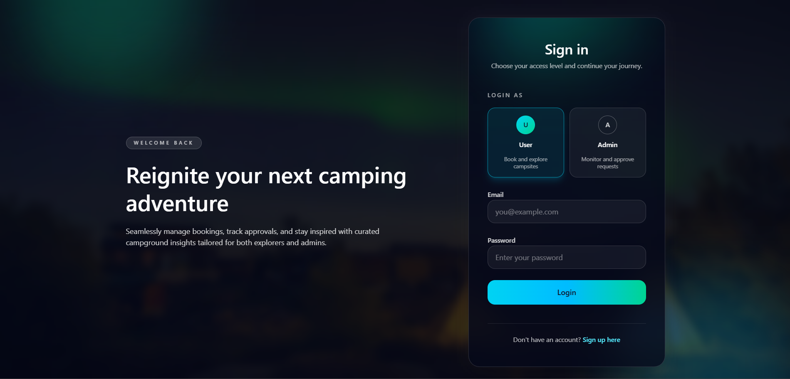
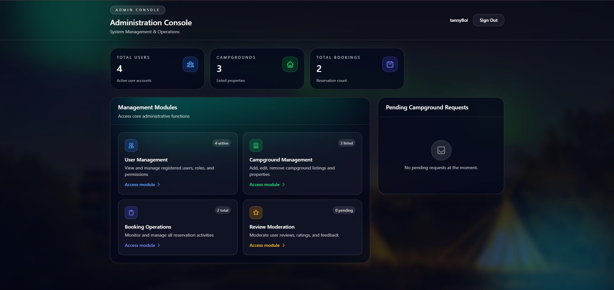
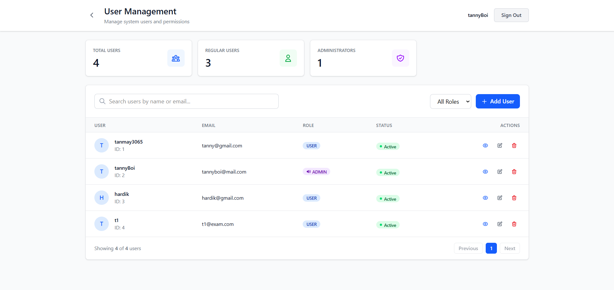
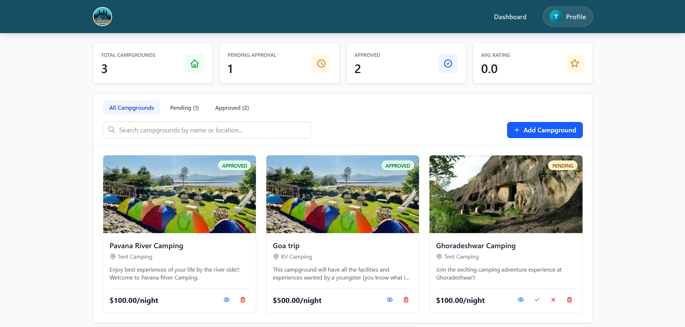
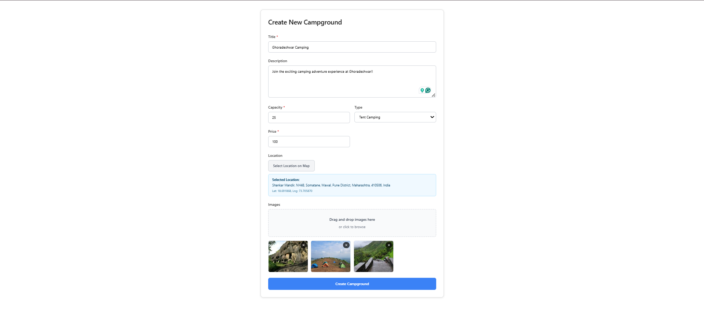
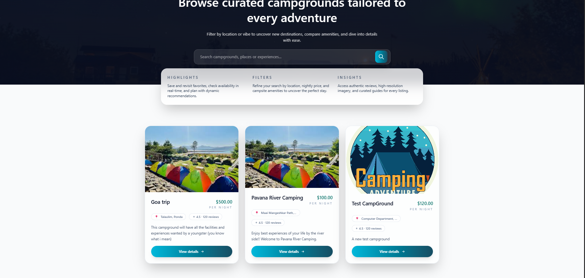
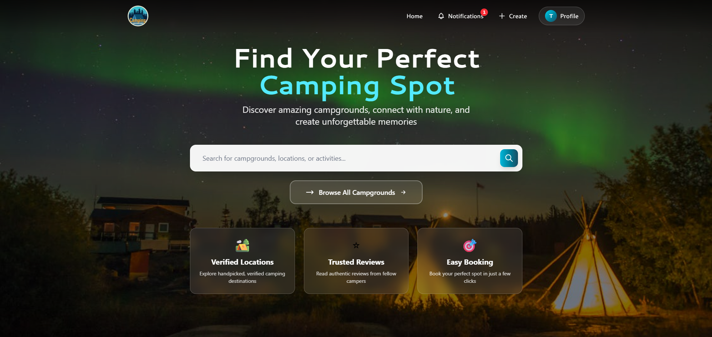
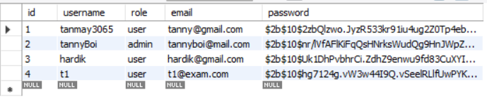
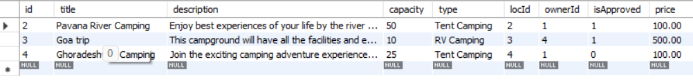

# CampGround Booking Platform

### GitHub Repository Link: [https://github.com/HardikMutha/DBMS_Project_SEM_V](https://github.com/HardikMutha/DBMS_Project_SEM_V)

### Team Members:
- Khush Gandhi - 612303058
- Hardik Mutha - 612303066
- Suswan Joglekar - 612303074
- Tanmay Karad - 612303083

### Project Snapshots:

- #### Frontend:
    - Authentication Pages:
    
    

    - Admin Pages:
    
    
    

    - Campground Creation Page:
    

    - Browse Campgrounds Page:
    

    - User Home Page:
    

- #### Backend:
    - User Table:
    

    - Campground Table:
    
